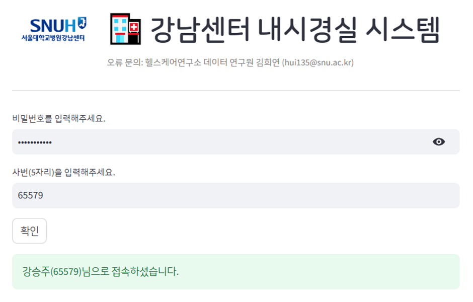
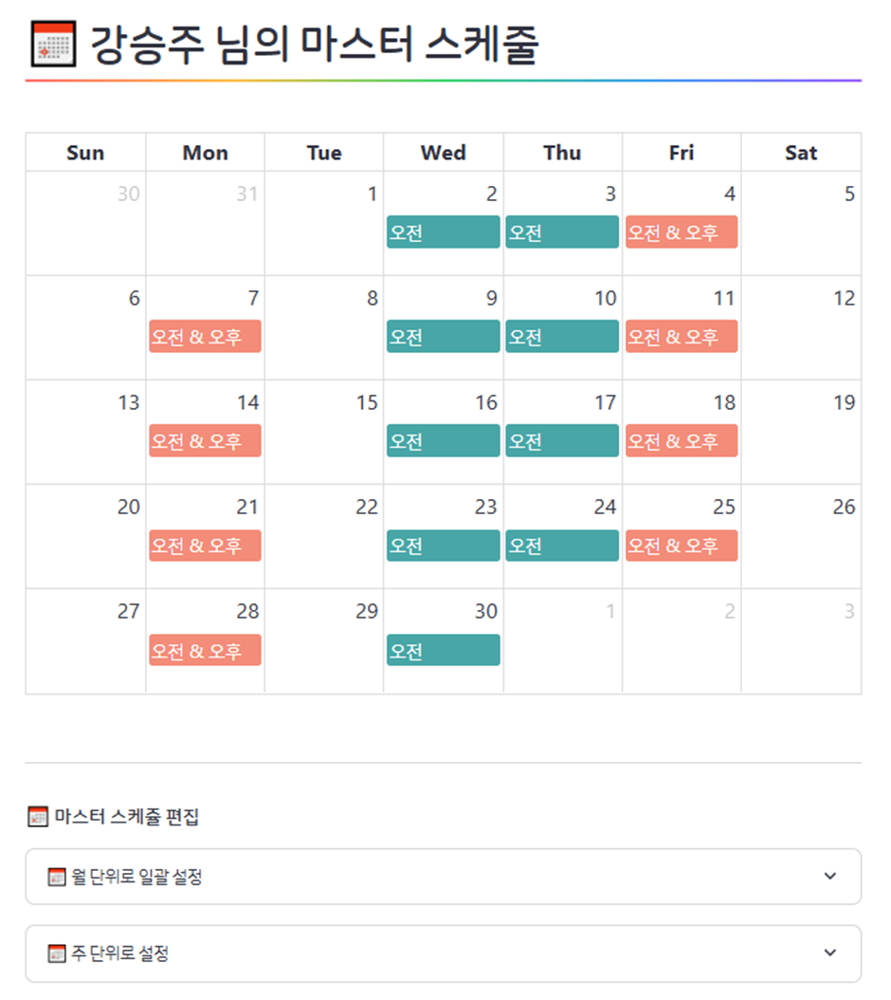
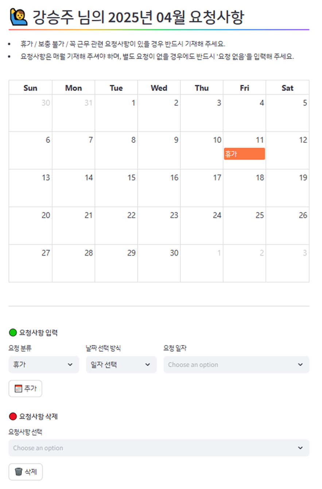
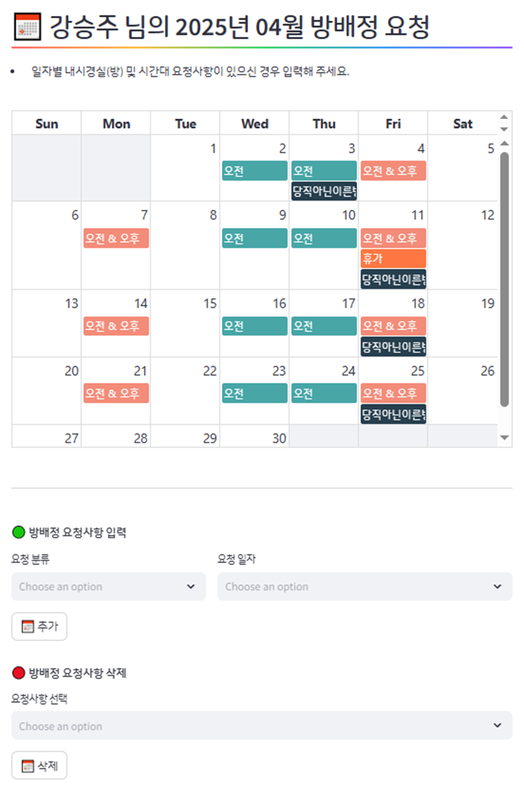

#🗓️ Streamlit 기반 근무 및 방 배정 시스템

Google Sheet와 연동하여 매월 근무 요청사항 및 휴가를 수합하고, 자동으로 스케쥴과 방 배정을 수행하는 시스템입니다.  
Streamlit을 통해 실시간으로 각 사용자 및 관리자가 접근할 수 있으며, 최종 결과는 Excel로 다운로드 가능합니다.

[👉 Streamlit 앱 바로가기](https://gc-endoscopy.streamlit.app)

---

## 🖼️ 예시 화면

### 🔐 로그인 / 사번 인증 화면

### 📅 마스터 수정 화면

### 🙋‍♂️ 요청사항 입력 화면

### 🙋‍♂️ (선택) 방배정 요청 화면

---

## 🚀 주요 기능

- Google Sheet 연동: 실시간 데이터 저장 및 불러오기
- 월별 요청사항 입력 및 마스터 스케쥴 관리
- 근무 및 방 배정 자동화 로직
- 결과 확인 및 Excel 출력 기능 지원
- 관리자 전용 페이지: 전체 스케쥴 확인 및 수기 조정 가능

---

## 📂 주요 구성 페이지

| 페이지 이름 | 설명 |
|-------------|------|
| **Home** | 사번 인증을 통해 개인 스케쥴 확인 및 요청 가능 |
| **마스터 관리** | 본인 사번에 해당하는 마스터 스케쥴 직접 수정 |
| **요청사항 입력** | 휴가 외 요청사항 등록 필수, 없을 경우 '요청 없음' 선택 |
| **방배정 요청** *(선택)* | 특정 방/시간대 요청 사항 입력 가능 |
| **[관리자] 스케쥴 관리** | 전체 사번의 마스터 및 요청사항 확인 및 수정 |
| **[관리자] 스케쥴 배정** | 마스터/요청사항 기반 자동 배정 (토요 근무 수기 입력 포함) |
| **[관리자] 방 배정** | 시간대별 방 개수 및 번호 지정 후 자동 배정 |
| **[관리자] 최종본** | 교환 반영 이후 최종 방배정표 확인, 누락 인원 점검 |

---

## ⚠️ 유의사항

> Google Sheet API 쿼터 제한으로 인해  
> 동시 접속 또는 대량 요청 시 오류가 발생할 수 있습니다.  

---

## 📤 결과물

- 최종 근무표 및 방배정표는 Excel로 다운로드 가능
- 관리자 화면에서 수기로 보정한 이후 업로드/확정 가능

---

## 🛠️ 기술 스택

- **Frontend**: Streamlit
- **Backend**: Python (Pandas, Numpy)
- **Data I/O**: Google Sheets API
- **Export**: openpyxl (Excel 다운로드)

---

## 📄 라이센스

본 프로젝트는 내부 배포용으로 개발되었으며, 비공개 사용을 전제로 합니다.
